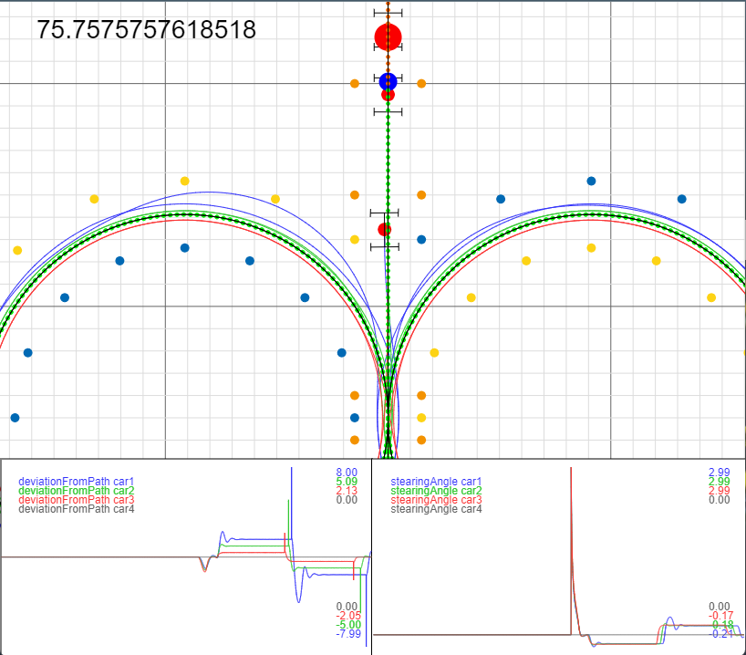

# Interactive Autonomous Simulator

This project is ment to provide a playground in which to interactifly play around with Autonomous Formula Student cars. To see and get a feel for how diffrent situations and algorithms might infulence the stability and performance of the car. 
The javascript library [P5JS](https://p5js.org/) is used for rendering the visualizations as its quick to iterate and debug with and made it simple enough to get the project running in an evening. The resulting webpage can be explored at https://spieterg.github.io/P5jsAutonomousSim/.



## Features and todo's
Following features have been implemented / are still to be implemented. Current focus is on testing controller simulation but simulating localization and mapping and visualizing how this is infuenced by sensor bias and noise would also be great. 

### Core functionality
- [x] Rendering the 2D map with pann and zoom controll
- [x] Track setup for skidpad
- [x] Car with bicicle model physics
- [x] Manual controller
- [x] Basic autonomous controller with speed and steering control

### Visualization and controller performance
- [x] Graphs displaying arbitrary value history
- [x] Multi car support
- [x] Simulating steering latancy
- [ ] Interface for initializing cars and their parameters 
- [x] Interface for selecting whats displayed on the graphs
- [x] simulating a full skidpad run offscreen and recording the loss determined by distance from the center line and rate of turn of the steering wheel
- [ ] Performing an offline gridsearch over controller parameters
- [ ] Visualzing the controller performance over the parameter space with some 2d graphs containing coloured dots
- [ ] Interface for configuring sensor bias, noise and latancy
- [ ] full body vehicle physics or at the very least some sort of sideslip or drifting
- [ ] Diffrent tracks, variable radii skidpads and other test enviroments

### Localization and mapping
- [x] Vision pipeline gathering visible cones from the perspective of the car (still needs to be translated to JS)
- [ ] Localization and mapping based on these cone positions
- [ ] State estimation based on this vision pipeline and fake imu measurements

# System overview

The main game loop is being run in `sketch.js`, a collection of global objects are being used througt the project kept in `globals.js`.

## Classes in the Project

The project consists of several classes, each serving a specific role in the car simulation. Here's an overview of the main classes:

### `Car` (in `carModel.js`)

The `Car` class represents the car in the simulation. It encapsulates the car's state variables, physics, and control. Key properties and methods include:

- State variables such as position, heading, velocity, and acceleration.
- Steering control with steering angle and delay.
- Physics models for the car's movement.
- Drawing functions to visualize the car's position and orientation.

```js
let steeringDealyMS = 50
let physicsFreq = 100;
let carColor = [50, 50, 250]

let car = new Car(steeringDealyMS * physicsFreq / 1000, carColor)

let forceSetpoint = 3000;
let steeringSetpoint = 0.1;
car.setSetpoints(forceSetpoint, steeringSetpoint);

car.update();
car.draw();
```

### `Cone` (in `cone.js`)

The `Cone` class represents different types of cones used in the simulation. It includes properties like position, type, and classification `[BLUE/YELLOW/SORANGE/BORANGE/VISION]`. Key methods include:

- `draw()` for rendering the cone on the canvas.

```js
let x = 5;
let y = 3;
let cone = new Cone(x, y, ConeType.SORANGE)
```

### `ConeMap` (in `coneMap.js`)

The `ConeMap` class manages a collection of cones used in the simulation. It provides methods for adding cones and drawing them on the canvas.

* `coneMap.addCone(x, y)` to generate a cone and add it to the cone map
* `coneMap.addCone(cone)` to add an existing cone to the cone map
* `createSkidpad(radius = 9.125)` in order to generate a conmap populated with the cones for a skidpad

```js
let coneMap = createSkidpad();

coneMap.draw();
```

### `ManualController` (in `manualController.js`)

The `ManualController` class allows manual control of the car using keyboard input. It translates user input into car actions, acceleration and steering.

```js 
let car = new Car(0, carColor)
let manualController = new new ManualController(car);
```

###  `UI` (in `ui.js`)

The `UI` class manages the user interface components for the simulation. It includes functionality to update and draw graphs showing car performance metrics.

#### How to Work with the `UI` Class:

- Create a `UI` instance, which sets up graphs for tracking car metrics.
- The `update()` method updates graph data with car metrics.
- Visualize graphs on the canvas using the `draw()` method.

### `WorldManager` (in `worldManager.js`)

The `WorldManager` class handles world space transformation, including scaling and panning. It provides options to draw a grid and coordinates for reference.

#### How to Work with the `WorldManager` Class:

- Create a `WorldManager` instance, which manages transformations and grid drawing.
- The `update()` method handles mouse-based panning.
- Use the `draw()` method to display the grid and coordinates.

#### Using world manager for dawing world space objects to the screen:

The world manager is one of the objects in the globals, stored as `wm`. This makes it easy to draw anything you want in world space.

- `wm.tX(worldspaceX)` in order to transform x from world space to screen space
- `wm.tY(worldspaceY)` to transform y from world to screen space
- `wm.rX(screenspaceX)` in order to re-transform x from screen space to world space
- `wm.rY(screenspaceY)` to transform y from screen to world space
- `wm.scaleW2S(worldspaceLenght)` to scale a length from world to screen space
- `wm.scaleS2W(screenspaceLenght)` to scale a length from screen to world space

For example you can draw a rectangle on the screen with:
```js
rect(wm.tX(3), wm.tY(16), wm.scaleW2S(1), wm.scaleW2S(2));
```

## How to Run

To run the car simulation, open the `index.html` file in a web browser. This will execute the p5.js sketch, allowing you to interact with the simulation.

## Additional Notes

- This project is designed for educational purposes and experimentation with autonomous vehicle physics and control.

- Feel free to explore and modify the code to customize the car's behavior, and add new features or controllers to the simulation.
